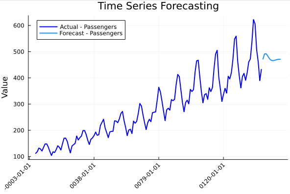

# Efficient Julia Implementation of ARIMA

This repository provides an efficient Julia implementation of the ARIMA (AutoRegressive Integrated Moving Average) model, designed to mirror the functionality of the popular statsforecast library in Python. The implementation leverages multithreading and the L-BFGS optimizer for fast and accurate parameter estimation.

## Key Features
- **Multithreading:** The implementation uses Julia's native multithreading capabilities to parallelize computationally intensive tasks, such as residual calculation and forecasting.
- **L-BFGS Optimizer:** The L-BFGS algorithm is used for efficient optimization of the ARIMA model parameters.
- **Module:** Module-based implementation allows for precompilation, driving faster speeds and using vectorization to speed up computations.

## Installation
To use this package, clone the repository and activate the environment:

```sh
git clone https://github.com/yourusername/CustomARIMA.git
cd CustomARIMA
julia --project=. --threads 4
```

Then, install the required dependencies:

```julia
using Pkg
Pkg.instantiate()
```

## Usage

### Fitting an ARIMA Model

```julia
using CustomARIMA

# Example data
y = [1.0, 2.0, 3.0, 4.0, 5.0, 6.0, 7.0, 8.0, 9.0, 10.0]

# Fit ARIMA model
model = CustomARIMA.arima(y, 2, 1, 1)

# Print results
println("AR coefficients: ", model.ar_coef)
println("MA coefficients: ", model.ma_coef)
println("Residual variance: ", model.sigma2)
```

### Forecasting

```julia
# Forecast next 12 periods
forecasts = CustomARIMA.forecast(model, 12)
println("Forecasts: ", forecasts)
```

### Visualization
To visualize the forecasting results, you can use the `plot_series` function:

```julia
Y_df = DataFrame(ds=collect(1:length(y)), Passengers=y)
Y_hat_df = DataFrame(ds=collect(length(y)+1:length(y)+12), Passengers=forecasts)
CustomARIMA.plot_series(Y_df, Y_hat_df)
```

## Visualization Example


## Performance Benchmarks

- **Execution Time Comparison** - Time reduced by at least 50% relative to the 'Statsforecast' library.
- **Forecast Accuracy Comparison** - <5% in average difference for 10-day forecasts. These results were tested over multiple datasets and hyperparameters.

## Acknowledgments
Inspired by the statsforecast library in Python.
