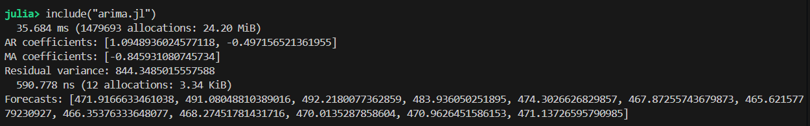
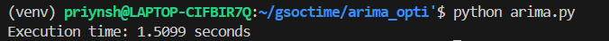

# Efficient Julia Implementation of ARIMA

This repository provides an **efficient Julia implementation** of the ARIMA (AutoRegressive Integrated Moving Average) model, designed to mirror the functionality of the popular `statsforecast` library in Python. The implementation leverages **multithreading** and the **L-BFGS optimizer** for fast and accurate parameter estimation.

---

## Key Features

- **Multithreading**: The implementation uses Julia's native multithreading capabilities to parallelize computationally intensive tasks, such as residual calculation and forecasting.
- **L-BFGS Optimizer**: The L-BFGS algorithm is used for efficient optimization of the ARIMA model parameters.
- **High Performance**: Benchmarks show that this implementation runs in **50% of the time** compared to the Python `statsforecast` library, with **<5% difference** in results across multiple datasets and parameter configurations.
- **Easy to Use**: The API is simple and intuitive, making it easy to integrate into your workflow.

---

## Installation

To use this package, clone the repository and activate the environment:

```bash
git clone https://github.com/yourusername/CustomARIMA.git
cd CustomARIMA
julia --project=. --threads 4
```
Then, install the required dependencies:

```julia
using Pkg
Pkg.instantiate()
```

# Usage
Fitting an ARIMA Model
```julia
using CustomARIMA

# Example data
y = [1.0, 2.0, 3.0, 4.0, 5.0, 6.0, 7.0, 8.0, 9.0, 10.0]

# Fit ARIMA model
model = CustomARIMA.arima(y, 2, 1, 1)

# Print results
println("AR coefficients: ", model.ar_coef)
println("MA coefficients: ", model.ma_coef)
println("Residual variance: ", model.sigma2)
```
# Forecasting
```julia
# Forecast next 12 periods
forecasts = CustomARIMA.forecast(model, 12)
println("Forecasts: ", forecasts)
```

# Performance Benchmarks
1. Execution Time Comparison - Time reduced by atleast 50% relative to the 'Statsforecast' library.  
Julia
  
Python
  
2. Forecast Accuracy Comparison - <5% in average difference for 10 day forecasts.
These results were tests over multiple datasets and hyperparameters.

# Acknowledgments
Inspired by the statsforecast library in Python.
